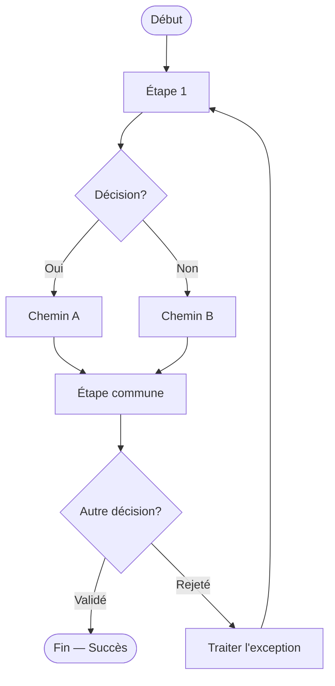
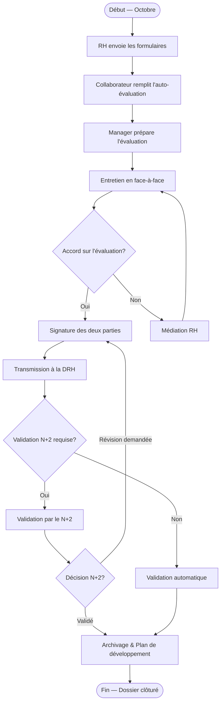

# Skill : Génération de Flowchart

## Objectif

Générer un diagramme de flux représentant un processus logique avec des étapes, des décisions et des chemins alternatifs. Le flowchart est le type le plus polyvalent : processus métier simple, arbre de décision, procédure opérationnelle, algorithme.

---

## Format de sortie

Utilise la syntaxe Mermaid `flowchart TD` (top-down, recommandé) ou `flowchart LR` (left-right pour les processus très linéaires).

---

## Conventions de notation

| Élément | Notation Mermaid | Usage |
|---|---|---|
| Début / Fin | `A([Texte])` | Événements terminaux (ovale) |
| Étape / Action | `B[Texte]` | Tâche réalisée (rectangle) |
| Décision | `C{Question?}` | Choix binaire ou multiple (losange) |
| Processus externe | `D[[Système externe]]` | Appel externe (rectangle double) |
| Document / Livrable | `E[/Document/]` | Artefact produit (parallélogramme) |
| Base de données | `F[(Base de données)]` | Stockage (cylindre) |
| Sous-processus | `G[[/Sous-processus/]]` | Processus délégué |
| Flèche avec label | `A -->|Label| B` | Condition sur le flux |
| Flèche sans label | `A --> B` | Flux direct |

---

## Règles de génération

1. **Un seul point d'entrée** et **au moins un point de sortie** bien définis.
2. **Décisions nommées** : le losange doit poser une question explicite avec un `?`.
3. **Branches labellisées** : toutes les sorties d'un losange doivent avoir un label (`|Oui|`, `|Non|`, `|Cas A|`...).
4. **Pas de chemin mort** : chaque branche aboutit à une étape suivante ou à un événement de fin.
5. **Convergence propre** : quand des branches alternatives se rejoignent, elles convergent vers un seul nœud avant de continuer.
6. **Profondeur maximale** : 3-4 niveaux de décision imbriqués. Au-delà, décomposer en sous-processus.
7. **Orientation** : `TD` (top-down) pour les processus hiérarchiques, `LR` pour les pipelines linéaires.

---

## Structure type

---

## Exemple complet : Processus d'évaluation annuelle

---

## Cas d'usage privilégiés

- Procédures opérationnelles standard (SOP)
- Arbres de décision (eligibilité, diagnostic)
- Processus d'approbation séquentiels
- Flux de traitement de demandes (tickets, commandes)
- Processus sans notion de couloir/acteur dominant

## Quand préférer BPMN à Flowchart

Utilise BPMN si : il y a plusieurs acteurs clairement distincts avec des responsabilités séparées, ou si le processus inclut des événements de déclenchement (timer, message externe).
