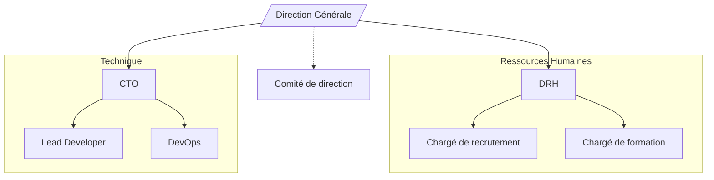
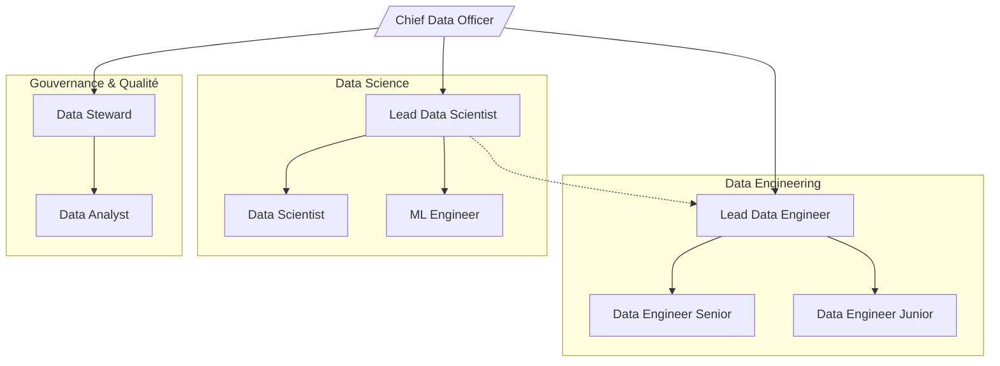

# Skill : Génération d'Organigramme

## Objectif

Générer un organigramme hiérarchique représentant la structure d'une organisation, d'une équipe ou d'un système. Le diagramme doit être lisible, logiquement structuré du haut (direction) vers le bas (opérationnel).

---

## Format de sortie

Utilise la syntaxe Mermaid `graph TD` (top-down). Pour des structures très larges, `graph LR` peut être utilisé.

---

## Conventions de notation

| Élément | Notation Mermaid |
|---|---|
| Poste / personne | `A[Titre du poste]` |
| Direction / pôle | `A[/Direction Générale/]` |
| Poste vacant | `A[Titre du poste ⬜]` |
| Lien hiérarchique (N+1) | `A --> B` |
| Lien fonctionnel (pointillé) | `A -.-> B` |
| Département (groupe) | `subgraph Dept["Département"]` |

---

## Règles de génération

1. **Racine unique** : l'organigramme a un seul nœud racine (PDG, DG, ou entité mère).
2. **Maximum 4 niveaux hiérarchiques** par diagramme. Au-delà, créer un sous-organigramme séparé.
3. **Nommer les postes, pas les personnes** — sauf si la description mentionne explicitement des noms.
4. **Distinguer lien hiérarchique et fonctionnel** : hiérarchique = flèche pleine, fonctionnel/transversal = flèche pointillée.
5. **Grouper par département** quand il y a 3 postes ou plus au même niveau sous le même supérieur.
6. **Nombre de postes** : idéalement 5 à 20 nœuds par diagramme.

---

## Structure type

---

## Exemple complet : Équipe Data

---

## Erreurs courantes à éviter

- Ne pas créer de cycles (A → B → A).
- Ne pas mettre des nœuds flottants sans lien vers la hiérarchie principale.
- Éviter les noms de nœuds trop longs (> 5 mots).
