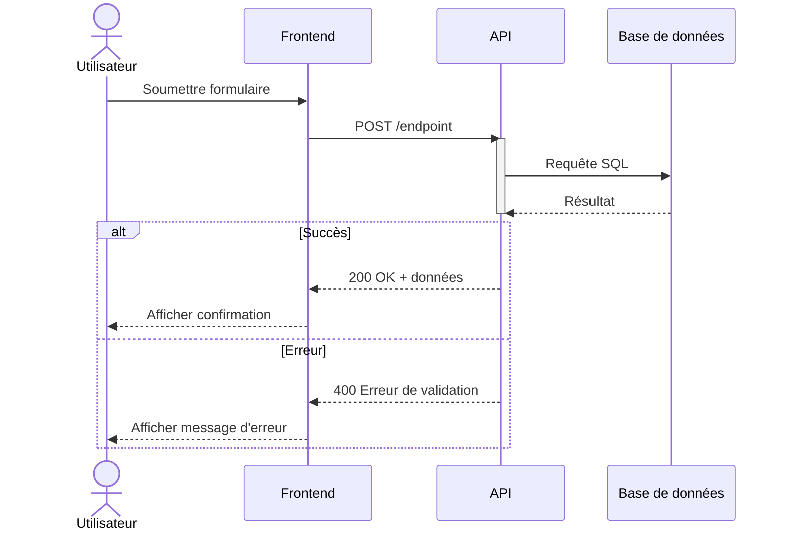
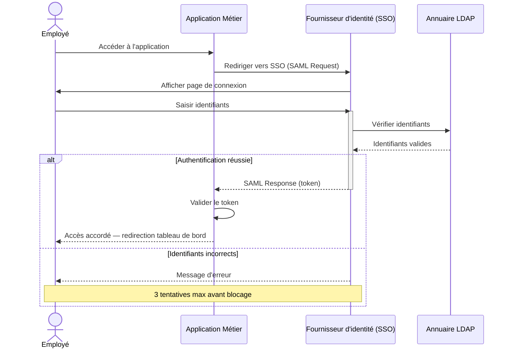

# Skill : Génération de Diagramme de Séquence

## Objectif

Générer un diagramme de séquence représentant les interactions chronologiques entre acteurs (humains ou systèmes). Idéal pour modéliser des échanges d'API, des processus d'authentification, des workflows multi-systèmes ou des protocoles de communication.

---

## Format de sortie

Utilise la syntaxe Mermaid `sequenceDiagram`.

---

## Conventions de notation

| Élément | Syntaxe Mermaid |
|---|---|
| Participant humain | `actor Nom` |
| Participant système | `participant Système` |
| Message synchrone | `A->>B: Message` |
| Message asynchrone | `A-)B: Message async` |
| Message de retour | `B-->>A: Réponse` |
| Note explicative | `Note over A,B: Explication` |
| Note à gauche | `Note left of A: Note` |
| Bloc conditionnel | `alt Condition` / `else` / `end` |
| Bloc optionnel | `opt Condition` / `end` |
| Boucle | `loop Répétition` / `end` |
| Bloc parallèle | `par Action 1` / `and Action 2` / `end` |
| Activation (durée de vie) | `activate A` / `deactivate A` |

---

## Règles de génération

1. **Ordre chronologique strict** : les messages s'exécutent de haut en bas dans l'ordre réel.
2. **Maximum 6 participants** : au-delà, la lisibilité chute. Regrouper les systèmes similaires.
3. **Messages clairs et courts** : label de message = action + objet (ex : `Envoyer facture PDF`, pas juste `Envoyer`).
4. **Retours explicites** : chaque requête synchrone doit avoir une réponse visible (`-->>`) si elle est attendue.
5. **Blocs alt/opt** pour les chemins alternatifs : ne pas multiplier les lignes de messages pour gérer les cas d'erreur — utiliser `alt`/`else`.
6. **Acteurs humains avec `actor`** : les humains utilisent `actor`, les systèmes et APIs utilisent `participant`.

---

## Structure type

---

## Exemple complet : Authentification SSO

---

## Erreurs courantes à éviter

- Ne pas oublier les `-->>` de retour pour les appels synchrones.
- Ne pas imbriquer trop profondément les blocs `alt`/`loop` (max 2 niveaux).
- Éviter les labels de messages avec des caractères spéciaux non échappés.
